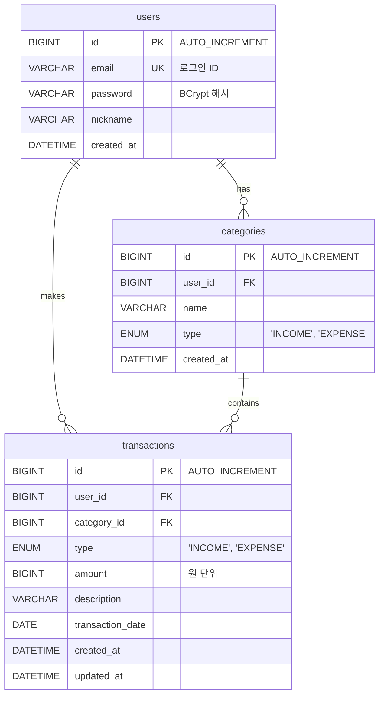

# 머니로그 ERD

```mermaid
erDiagram
    users ||--o{ categories : "has"
    users ||--o{ transactions : "makes"
    categories ||--o{ transactions : "contains"

    users {
        BIGINT id PK "AUTO_INCREMENT"
        VARCHAR email UK "로그인 ID"
        VARCHAR password "BCrypt 해시"
        VARCHAR nickname
        DATETIME created_at
    }
    
    categories {
        BIGINT id PK "AUTO_INCREMENT"
        BIGINT user_id FK
        VARCHAR name
        ENUM type "'INCOME', 'EXPENSE'"
        DATETIME created_at
    }
    
    transactions {
        BIGINT id PK "AUTO_INCREMENT"
        BIGINT user_id FK 
        BIGINT category_id FK
        ENUM type "'INCOME', 'EXPENSE'"
        BIGINT amount "원 단위"
        VARCHAR description
        DATE transaction_date
        DATETIME created_at
        DATETIME updated_at
    }
```