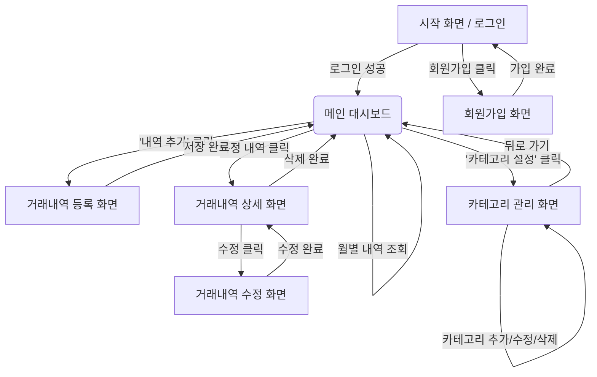

# 머니로그(MoneyLog) 화면 흐름도 및 API 매핑

이 문서는 사용자가 머니로그 웹 서비스에서 경험하게 될 화면 이동 흐름과, 
각 화면에서 발생하는 이벤트에 따라 어떤 API가 호출되는지를 정의합니다.

---

## 1. 화면 흐름도 (Screen Flow)

---

## 2. 화면별 API 매핑 정의서

각 화면 단위로 사용자가 수행할 수 있는 액션과, 이를 처리하기 위해 프론트엔드가 백엔드로 요청해야 하는 API 목록입니다.

### 2.1. 시작 / 인증 화면
사용자가 처음 서비스에 접속하여 로그인하거나 회원가입을 진행하는 화면입니다.
- **[화면] 로그인 폼**
    - 로그인 버튼 클릭 ➡️ `POST /api/auth/login`
- **[화면] 회원가입 폼**
    - 회원가입 버튼 클릭 ➡️ `POST /api/auth/signup`

### 2.2. 메인 대시보드 화면
로그인 직후 마주하는 메인 화면으로, 선택한 월의 수입/지출 통계 요약과 거래내역 리스트를 보여줍니다.
- **[화면 로드 시]**
    - 이번 달 통계 데이터 조회 ➡️ `GET /api/statistics/monthly?yearMonth={YYYY-MM}`
    - 이번 달 거래내역 목록 조회 ➡️ `GET /api/transactions?yearMonth={YYYY-MM}&page=0&size=20`
- **[액션] 필터 조건 변경 (월 변경, 수입/지출 탭 클릭 등)**
    - 변경된 조건으로 목록 다시 조회 ➡️ `GET /api/transactions?yearMonth={YYYY-MM}&type={TYPE}...`

### 2.3. 거래내역 등록/수정 화면
새로운 수입/지출 내역을 입력하거나 기존 내역을 수정하는 폼 화면입니다.
- **[화면 로드 시 (공통)]**
    - 선택 가능한 내 카테고리 목록 조회 ➡️ `GET /api/categories`
- **[화면] 신규 등록 폼**
    - 저장 버튼 클릭 ➡️ `POST /api/transactions`
- **[화면] 수정 폼**
    - 기존 거래내역 상세 정보 불러오기 ➡️ `GET /api/transactions/{id}`
    - 수정 완료 버튼 클릭 ➡️ `PUT /api/transactions/{id}`

### 2.4. 거래내역 상세 화면
대시보드 리스트에서 특정 건을 클릭했을 때 나타나는 상세 정보 모달(또는 페이지)입니다.
- **[화면 로드 시]**
    - 거래내역 상세 조회 ➡️ `GET /api/transactions/{id}`
- **[액션] 삭제 버튼 클릭**
    - 거래내역 삭제 요청 ➡️ `DELETE /api/transactions/{id}`

### 2.5. 카테고리 관리 화면
사용자 본인만의 커스텀 카테고리를 조회하고 추가/수정/삭제하는 화면입니다.
- **[화면 로드 시]**
    - 내 카테고리 전체 목록 조회 ➡️ `GET /api/categories`
- **[액션] 새 카테고리 추가**
    - 추가 버튼 클릭 ➡️ `POST /api/categories`
- **[액션] 기존 카테고리 이름 수정**
    - 수정 버튼 클릭 ➡️ `PUT /api/categories/{id}`
- **[액션] 카테고리 삭제**
    - 삭제 버튼 클릭 ➡️ `DELETE /api/categories/{id}`